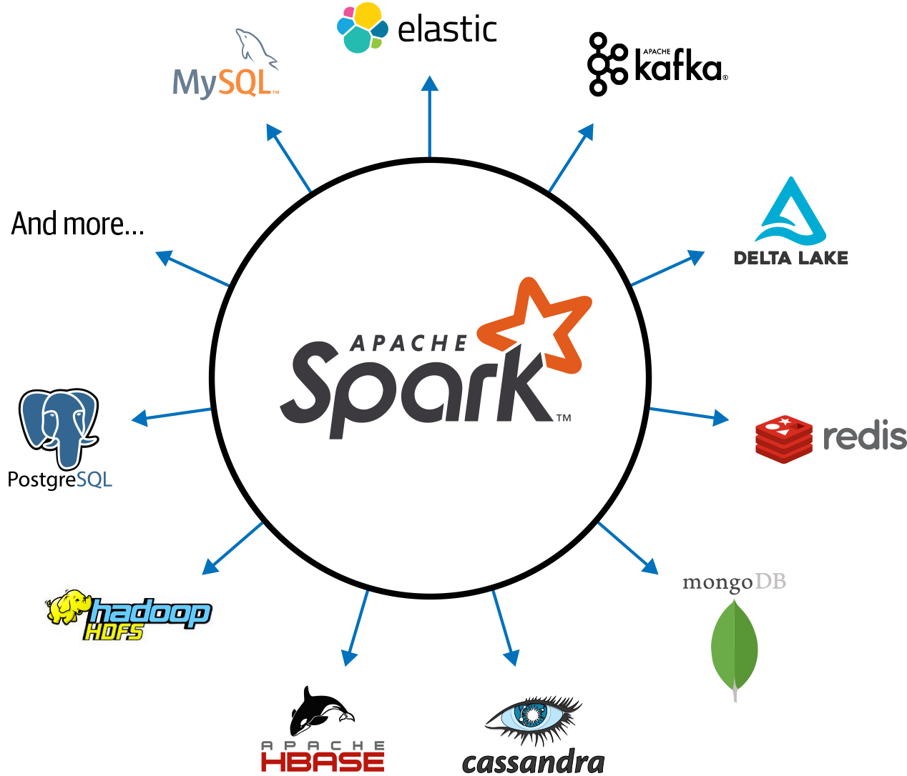

# **Spark**

    Lightning-Fast Data Analytics

## Introduction to Apache Spark: A Unified Analytics Engine

### The Genesis of Spark

- Big Data and Distributed Computing at Google
- Hadoop at Yahoo!
- Spark’s Early Years at AMPLab

### What Is Apache Spark?

O Apache Spark é um mecanismo unificado projetado para processamento distribuído de dados em larga escala, localmente em data centers ou na nuvem.

O Spark fornece armazenamento na memória para cálculos intermediários, tornando-o muito mais rápido que o Hadoop MapReduce. Ele incorpora bibliotecas com APIs compostas para aprendizado de máquina (**MLlib**), SQL para consultas interativas (**Spark SQL**), processamento de fluxo (**Structured Streaming**) para interagir com dados em tempo real e processamento de grafos (**GraphX**).

A filosofia de design do Spark gira em torno de quatro características principais:

#### Speed

Spark perseguiu o objetivo de velocidade de várias maneiras. Primeiro, sua implementação interna se beneficia imensamente dos grandes avanços recentes da indústria de hardware para melhorar o preço e o desempenho de CPUs e memória. Os servidores comuns de hoje são baratos, com centenas de gigabytes de memória, vários núcleos e o sistema operacional baseado em Unix subjacente, aproveitando o multithreading eficiente e o processamento paralelo. A estrutura é otimizada para aproveitar todos esses fatores.

Em segundo lugar, o Spark constrói seus cálculos de consulta como um gráfico acíclico direcionado (DAG); seu agendador de DAG e otimizador de consulta constroem um gráfico computacional eficiente que geralmente pode ser decomposto em tarefas que são executadas em paralelo entre os trabalhadores do cluster. E terceiro, seu mecanismo de execução física, Tungsten, usa geração de código de estágio inteiro para gerar código compacto para execução (vamos abordar a otimização SQL e geração de código de estágio inteiro no Capítulo 3). Com todos os resultados intermediários retidos na memória e sua E/S de disco limitada, isso proporciona um enorme aumento de desempenho.

#### Ease of Use

O Spark alcança a simplicidade fornecendo uma abstração fundamental de uma estrutura de dados lógica simples chamada Resilient Distributed Dataset (RDD) sobre a qual todas as outras abstrações de dados estruturados de nível superior, como DataFrames e Datasets, são construídas. Ao fornecer um conjunto de transformações e ações como operações, o Spark oferece um modelo de programação simples que você pode usar para criar aplicativos de big data em linguagens familiares.

#### Modularity

As operações do Spark podem ser aplicadas em vários tipos de cargas de trabalho e expressas em qualquer uma das linguagens de programação compatíveis: Scala, Java, Python, SQL e R. O Spark oferece bibliotecas unificadas com APIs bem documentadas que incluem os seguintes módulos como componentes principais: Spark SQL, Spark Structured Streaming, Spark MLlib e GraphX, combinando todas as cargas de trabalho executadas em um mecanismo. Vamos dar uma olhada em tudo isso na próxima seção.

Você pode escrever um único aplicativo Spark que pode fazer tudo — sem necessidade de mecanismos distintos para cargas de trabalho diferentes, sem necessidade de aprender APIs separadas. Com o Spark, você obtém um mecanismo de processamento unificado para suas cargas de trabalho.

#### Extensibility

O Spark se concentra em seu mecanismo de computação paralelo rápido e não no armazenamento. Ao contrário do Apache Hadoop, que incluía armazenamento e computação, o Spark separa os dois.

Isso significa que você pode usar o Spark para ler dados armazenados em inúmeras fontes – **Apache Hadoop**, **Apache Cassandra**, **Apache HBase**, **MongoDB**, **Apache Hive**, **RDBMSs** e muito mais – e processar tudo na memória. Os DataFrameReaders e DataFrame Writers do Spark também podem ser estendidos para ler dados de outras fontes, como **Apache Kafka**, **Kinesis**, **Azure Storage** e **Amazon S3**, em sua abstração lógica de dados, na qual ele pode operar.

A comunidade de desenvolvedores Spark mantém uma lista de pacotes Spark de terceiros como parte do ecossistema crescente (veja a Figura 1-2). Esse rico ecossistema de pacotes inclui conectores Spark para uma variedade de fontes de dados externas, monitoramento de desempenho, e muito mais.


*Figure 1-2. Apache Spark’s ecosystem of connectors*

### Unified Analytics

Embora a noção de unificação não seja exclusiva do Spark, é um componente central de sua filosofia de design e evolução. Em novembro de 2016, a Association for Computing Machinery (ACM) reconheceu o Apache Spark e conferiu a seus criadores originais o prestigioso prêmio ACM por seu artigo descrevendo o Apache Spark como um “Mecanismo Unificado para Processamento de Big Data”. O artigo premiado observa que o Spark substitui todos os mecanismos separados de processamento em lote, gráfico, fluxo e consulta, como Storm, Impala, Dremel, Pregel, etc., por uma pilha unificada de componentes que aborda diversas cargas de trabalho em um único mecanismo rápido distribuído.

#### Apache Spark Components as a Unified Stack

Conforme mostrado na Figura 1-3, o Spark oferece quatro componentes distintos como bibliotecas para diversas cargas de trabalho: **Spark SQL**, **Spark MLlib**, **Spark Structured Streaming** e **GraphX**. Cada um desses componentes é separado do mecanismo principal tolerante a falhas do Spark, pois você usa APIs para escrever seu aplicativo Spark e o Spark converte isso em um DAG que é executado pelo mecanismo principal. Portanto, se você escreve seu código Spark usando as APIs estruturadas fornecidas (que abordaremos no Capítulo 3) em **Java**, **R**, **Scala**, **SQL** ou **Python**, o código subjacente é decomposto em bytecode altamente compacto que é executado nas JVMs dos trabalhadores em todo o cluster.


*Figure 1-3. Apache Spark components and API stack*

Vamos ver cada um desses componentes com mais detalhes.

##### Spark SQL

Este módulo funciona bem com dados estruturados. Você pode ler dados armazenados em uma tabela RDBMS ou de formatos de arquivo com dados estruturados (**CSV**, **texto**, **JSON**, **Avro**, **ORC**, **Parquet** etc.) e construir tabelas permanentes ou temporárias no Spark. Além disso, ao usar as APIs estruturadas do Spark em Java, Python, Scala ou R, você pode combinar consultas do tipo SQL para consultar os dados lidos em um Spark DataFrame. Até o momento, o Spark SQL é compatível com ANSI SQL:2003 e também funciona como um mecanismo SQL puro.

Por exemplo, neste trecho de código Scala, você pode ler um arquivo JSON armazenado no Amazon S3, criar uma tabela temporária e emitir uma consulta semelhante a SQL nos resultados lidos na memória como um Spark DataFrame:

```scala
    // In Scala
    // Read data off Amazon S3 bucket into a Spark DataFrame
    spark.read
        .json("s3://apache_spark/data/committers.json")
        .createOrReplaceTempView("committers")
    // Issue a SQL query and return the result as a Spark DataFrame
    val results = spark.sql("""
        SELECT name, org, module, release, num_commits
        FROM committers 
        WHERE module = 'mllib' AND num_commits > 10
        ORDER BY num_commits DESC
        """)
```

Você pode escrever trechos de código semelhantes em Python, R ou Java, e o bytecode gerado será idêntico, com o mesmo desempenho.

##### Spark MLlib

O Spark vem com uma biblioteca contendo algoritmos comuns de aprendizado de máquina (ML) chamados MLlib. Desde o primeiro lançamento do Spark, o desempenho desse componente de biblioteca melhorou significativamente devido aos aprimoramentos de mecanismo subjacentes do Spark 2.x.
O MLlib fornece muitos algoritmos de aprendizado de máquina populares construídos sobre APIs baseadas em DataFrame de alto nível para criar modelos.

> - A partir do Apache Spark 1.6, o projeto MLlib é dividido em dois pacotes: spark.mllib e spark.ml. A API baseada em DataFrame é a última, enquanto a primeira contém as APIs baseadas em RDD, que agora estão em modo de manutenção. Todos os novos recursos vão para spark.ml. Este livro se refere a “MLlib” como a biblioteca guarda-chuva para aprendizado de máquina no Apache Spark.

Essas APIs permitem que você extraia ou transforme recursos, crie pipelines (para treinamento e avaliação) e persista modelos (para salvá-los e recarregá-los) durante a implantação. Utilitários adicionais incluem o uso de operações e estatísticas comuns de álgebra linear. MLlib inclui outras primitivas de ML de baixo nível, incluindo uma otimização genérica de gradiente descendente. O trecho de código Python a seguir encapsula as operações básicas que um cientista de dados pode fazer ao construir um modelo (exemplos mais extensos serão discutidos nos Capítulos 10 e 11):

```python
    # In Python
    from pyspark.ml.classification import LogisticRegression
    ...
    training = spark.read.csv("s3://...")
    test = spark.read.csv("s3://...")
    # Load training data
    lr = LogisticRegression(maxIter=10, regParam=0.3, elasticNetParam=0.8)
    # Fit the model
    lrModel = lr.fit(training)
    # Predict
    lrModel.transform(test)
    ...
```

##### Spark Structured Streaming

O Apache Spark 2.0 introduziu um modelo experimental de streaming contínuo e APIs de streaming estruturado, construídas sobre o mecanismo Spark SQL e APIs baseadas em DataFrame. No Spark 2.2, o Structured Streaming estava disponível para todos, o que significa que os desenvolvedores podiam usá-lo em seus ambientes de produção.

Necessário para os desenvolvedores de big data combinarem e reagirem em tempo real a dados estáticos e dados de streaming de mecanismos como Apache Kafka e outras fontes de streaming, o novo modelo visualiza um fluxo como uma tabela em crescimento contínuo, com novas linhas de dados anexadas no final . Os desenvolvedores podem simplesmente tratar isso como uma tabela estruturada e emitir consultas como fariam com uma tabela estática.

Sob o modelo de streaming estruturado, o mecanismo central do Spark SQL lida com todos os aspectos de tolerância a falhas e semântica de dados tardios, permitindo que os desenvolvedores se concentrem em escrever aplicativos de streaming com relativa facilidade. Esse novo modelo eliminou o antigo modelo DStreams na série 1.x do Spark, que discutiremos com mais detalhes no Capítulo 8. Armazenamento baseado em HDFS ou em nuvem.

O trecho de código a seguir mostra a anatomia típica de um aplicativo de streaming estruturado. Ele lê de um soquete localhost e grava os resultados da contagem de palavras em um tópico do Apache Kafka:

```python
    # In Python
    # Read a stream from a local host
    from pyspark.sql.functions import explode, split

    lines = (
        spark.readStream.format("socket")
        .option("host", "localhost")
        .option("port", 9999)
        .load()
    )
    # Perform transformation
    # Split the lines into words
    words = lines.select(explode(split(lines.value, " ")).alias("word"))
    # Generate running word count
    word_counts = words.groupBy("word").count()
    # Write out to the stream to Kafka
    query = word_counts.writeStream.format("kafka").option("topic", "output")

```

##### GraphX

Como o nome sugere, o GraphX é uma biblioteca para manipular grafos (por exemplo, grafos de redes sociais, rotas e pontos de conexão ou grafos de topologia de rede) e realizar cálculos paralelos a grafos. Ele oferece os algoritmos de grafo padrão para análise, conexões e travessias, contribuídos por usuários da comunidade: os algoritmos disponíveis incluem **PageRank**, **Connected Components** e **Triangle Counting**.

Este snippet de código mostra um exemplo simples de como unir dois grafos usando as APIs do GraphX:

```scala
    // In Scala
    val graph = Graph(vertices, edges)
    messages = spark.textFile("hdfs://...")
    val graph2 = graph.joinVertices(messages) {
        (id, vertex, msg) => ...
    }
```

#### Apache Spark’s Distributed Execution

Se você leu até aqui, já sabe que o Spark é um mecanismo de processamento de dados distribuído com seus componentes trabalhando de forma colaborativa em um cluster de máquinas. Antes de explorarmos a programação com o Spark nos próximos capítulos deste livro, você precisa entender como todos os componentes da arquitetura distribuída do Spark trabalham juntos e se comunicam, e quais modos de implantação estão disponíveis.
Vamos começar examinando cada um dos componentes individuais mostrados na Figura 1-4 e como eles se encaixam na arquitetura. Em um alto nível na arquitetura Spark, um aplicativo Spark consiste em um programa de driver que é responsável por orquestrar operações paralelas no cluster Spark. O driver acessa os componentes distribuídos no cluster - os executores do Spark e o gerenciador de cluster - por meio de uma SparkSession.


*Figure 1-4. Apache Spark components and architecture*

##### Spark driver

Como parte do aplicativo Spark responsável por instanciar uma SparkSession, o driver Spark tem várias funções: ele se comunica com o gerenciador do cluster; solicita recursos (CPU, memória, etc.) do gerenciador de cluster para os executores do Spark (JVMs); e transforma todas as operações do Spark em cálculos do DAG, agenda-os e distribui sua execução como tarefas entre os executores do Spark. Uma vez alocados os recursos, ele se comunica diretamente com os executores.

##### SparkSession

No Spark 2.0, o SparkSession tornou-se um canal unificado para todas as operações e dados do Spark. Não apenas subsumiu pontos de entrada anteriores ao Spark, como `SparkContext`, `SQLContext`, `HiveContext`, `SparkConf` e `StreamingContext`, mas também tornou o trabalho com o Spark mais simples e fácil.

> Embora no Spark 2.x o `SparkSession` inclua todos os outros contextos, você ainda pode acessar os contextos individuais e seus respectivos métodos. Desta forma, a comunidade manteve a compatibilidade com versões anteriores.
Ou seja, seu código 1.x antigo com `SparkContext` ou `SQLContext` ainda funcionará.

Por meio desse canal, você pode criar parâmetros de tempo de execução da JVM, definir DataFrames e Datasets, ler fontes de dados, acessar metadados de catálogo e emitir consultas Spark SQL. `SparkSession` fornece um único ponto de entrada unificado para todas as funcionalidades do Spark.

Em um aplicativo Spark autônomo, você pode criar uma `SparkSession` usando uma das APIs de alto nível na linguagem de programação de sua escolha. No shell Spark (mais sobre isso no próximo capítulo) a `SparkSession` é criada para você e você pode acessá-la por meio de uma variável global chamada `spark` ou `sc`.

Enquanto no Spark 1.x você teria que criar contextos individuais (para streaming, SQL, etc.), introduzindo código clichê extra, em um aplicativo Spark 2.x você pode criar um `SparkSession` por JVM e usá-lo para executar um número das operações do Spark.
Vejamos um exemplo:

```scala
    // In Scala
    import org.apache.spark.sql.SparkSession
    // Build SparkSession
    val spark = SparkSession
    .builder
    .appName("LearnSpark")
    .config("spark.sql.shuffle.partitions", 6)
    .getOrCreate()
    ...
    // Use the session to read JSON
    val people = spark.read.json("...")
    ...
    // Use the session to issue a SQL query
    val resultsDF = spark.sql("SELECT city, pop, state, zip FROM table_name")
```

##### Cluster manager

O gerenciador de cluster é responsável por gerenciar e alocar recursos para o cluster de nós no qual seu aplicativo Spark é executado. Atualmente, o Spark oferece suporte a quatro gerenciadores de cluster: o gerenciador de cluster autônomo integrado, Apache Hadoop YARN, Apache Mesos e Kubernetes.

##### Spark executor

Um executor do Spark é executado em cada nó do trabalhador no cluster. Os executores se comunicam com o programa driver e são responsáveis ​​por executar tarefas nos trabalhadores. Na maioria dos modos de implantação, apenas um único executor é executado por nó.

##### Deployment modes

Um recurso atraente do Spark é seu suporte a diversos modos de implantação, permitindo que o Spark seja executado em diferentes configurações e ambientes. Como o gerenciador de cluster é independente de onde é executado (desde que possa gerenciar os executores do Spark e atender às solicitações de recursos), o Spark pode ser implantado em alguns dos ambientes mais populares — como Apache Hadoop YARN e Kubernetes — e pode operar em diferentes modos. A Tabela 1-1 resume os modos de implantação disponíveis.

| Mode | Spark driver | Spark executor | Cluster manager |
| :---: | :---: | :---: | :---: |
| Local | Runs on a single JVM, like a laptop or single node | Runs on the same JVM as the driver | Runs on the same host |
| Standalone | Can run on any node in the cluster |cell data3| Each node in the cluster will launch its own executor JVM | Can be allocated arbitrarily to any host in the cluster |
| YARN (client) | Runs on a client, not part of the cluster | YARN’s NodeManager’s container | YARN’s Resource Manager works with YARN’s Application Master to allocate the containers on NodeManagers for executors |
| YARN (cluster) | Runs with the YARN Application Master | Same as YARN client mode | Same as YARN client mode |
| Kubernetes | Runs in a Kubernetes pod | Each worker runs within its own pod | Kubernetes Master |
